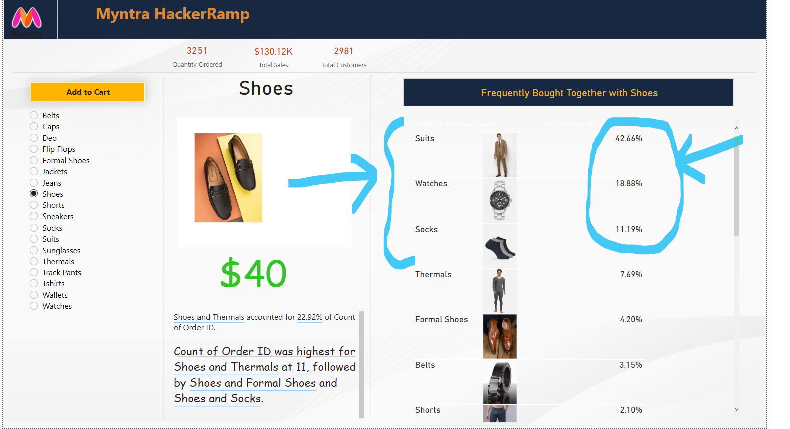

## Title
***
_Recommending Add-ons for items in Myntra cart_

## Purpose
***

This project was created for Phase 2: Implementation of [Myntra HackerRamp: Campus Edition 2021](https://dare2compete.com/competition/myntra-hackerramp-campus-edition-2021-myntra-201010)

## Usage
***
Directly Run
>_reccomendation3.pbix_ file using Microsoft Power BI Desktop software

## Description
***
Frequently bought together items is a widely used recommendation engine that shows the users what items were bought with a particular purchased item.

The recommendation is usually the top most purchased together permutation.  This is often seen at the time of purchase to encourage a user to increase their cart value.

### Cart Design

---
### What's trending?

---
### Looks good together!

---
### Stats

We used the Itertools library in Python and visualized this in Power BI

### Dependencies:
* Any OS supporting Power BI
* Python
* numpy and pandas 
* itertools

***
***
### Contributers:
Inzemam, Prateek and Jatin